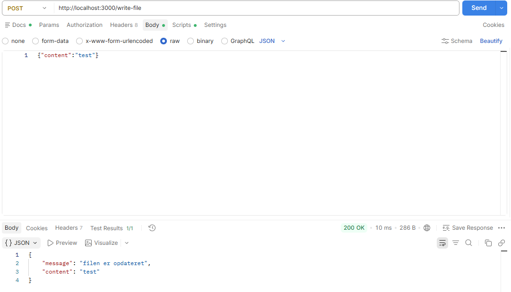

# Node.js Ninja – asynkron, event-driven server

## Hvad laver programmet?

En fuldt funktionel Express-server på port 3000 lokalt.
Serveren kan aflæser og skrive data direkte på data/data.txt asynkront via fs promises og async/await
Alle request (200, 400, 404 500 osv) bliver logged i logs/requests.log.
Programmet retunere derefter json med relevante statuskoder

## Kørsel

```
npm install
npm start                # starter serveren på http://localhost:3000
npm run clients          # (i ny terminal) sender 10 samtidige requests
```

---

## Gruppens plan (lavet før vi kodede)

| Spørgsmål | Gruppens beslutning                                                                                                                                  |
|---|------------------------------------------------------------------------------------------------------------------------------------------------------|
| Hvilke filer skal projektet have? | `app.js` + 4 klasser i `src/` (Server, FileController, FileService, RequestLogger), `data/data.txt`, `logs/requests.log`, `tests/simulate_clients.js` |
| Hvor håndteres routes? | I `Server.registerRoutes()`, som sender videre til metoder i `FileController`                                                                        |
| Hvor anvendes async/await? | Vi ønsker at bruge det alle steder hvor vi kunne riskere at afvente et svar tilbage. Fx i requestLogger hvor vi bruger async til at log en besked.   |
| Hvor håndteres fejl? | Fejl håndteres i vores controller hvor der kan ske crashes ved enten write eller read.                                                               |
| Hvilket event skal udsendes? | Vi udsender et custom event via EventEmitter som fx log ved modtage af et request                                                                    |
| Hvad skal loggen indeholde? | timestamp, method (GET/POST) url og status status                                                                                                    |
| Hvordan vil I teste fejlforløbet? | Vi vil gerne teste via POSTMAN og med en simulation af flere forspørgsler på en gang                                                                 |

**Feedback fra anden studiegruppe:**

Vores originale indeholdte ikke en super "arkitektur" venlig løsning. Den anden studiegruppe
gjorde krav på at vi gjorde det med bedre arkitektur
Vi tilføjede også en errorHandler middleware da vi ellers ikke kunne fange fejl som ødelagt json fra express.json

---

## Projektstruktur og klassernes ansvar

```
app.js                              Opretter objekterne og giver dem til hinanden
Server.js                Express-app: middleware, routes, 404, fejl-handler
FileController.js   HTTP-laget: validerer input, vælger statuskode
FileService.js         Fil-laget: læser og skriver data.txt (kender intet til HTTP)
RequestLogger.js        extends EventEmitter – lytter på 'request' og logger
simulate_clients.js           Sender 10 samtidige requests
```

Vi har valgt at opdele det på samme måde som vi kender fra java med controller - service
Klasserne laver ikke selv de objekter, de bruger. De får dem givet i constructoren fra app.js (dependency injection).

---

## Endpoints

| Metode | Endpoint | Funktion | Statuskoder |
|---|---|---|---|
| GET | `/` | Tjekker at serveren kører | 200 |
| GET | `/read-file` | Læser `data/data.txt` og returnerer indholdet | 200, 500 |
| POST | `/write-file` | Overskriver `data/data.txt` med `content` fra body | 200, 400, 500 |
| * | alt andet | Ukendt route | 404 |

Eksempel på body til POST:
```json
{ "content": "Ny tekst til filen" }
```

| Kode | Hvornår |
|---|---|
| 200 | Læsning/skrivning lykkedes |
| 400 | Klienten sendte noget forkert: `content` mangler, er ikke tekst, er tom, eller JSON er ugyldig |
| 404 | Routen findes ikke |
| 500 | Serveren kunne ikke læse/skrive filen |

---

## Asynkronitet

Node.js har kun én tråd. Hvis filoperationer var synkrone, skulle alle andre requests vente. Ved at bruge Async/Await kan man skrive "asynkron kode" så det læses og ses 
som synkron kode. Det bedste eksempel er fx i requestLogger hvor vi skriver til en fil men at vi kan lave andet imens
Vi er altså ikke låst i programmet imens at vi skriver data i filen.
Ved Await pauser vi funktionen og tråden frigives tilbage til event loopet. Indtil vi modtager et svar.
Da vi lavede testene på 10 klienter kunne vi riskiere at klient 8 fx svarede før 7 hvilket beviser at flere kan arbejde sammetid,
også at svarene kommer i den hurtigste rækkefølge ikke den som de blev sendt i.

---

## EventEmitter

Vi bruger EventEmitter til at logge alle requests. Vores klasse RequestLogger arver fra
EventEmitter (extends EventEmitter), så den får metoderne `on` og `emit` med.

Hvilket event?
Vi har lavet vores eget event, som hedder 'request'. Det bliver udsendt én gang for hver
request, der kommer ind på serveren, uanset om svaret er 200, 400, 404 eller 500.

Hvor bliver det udsendt (`emit`)?
I log-middlewaren i Server.js. Når en request kommer ind, gemmer vi starttidspunktet. Vi
venter derefter med at sende eventet, til svaret er sendt (`res.on('finish')`), fordi vi først
der kender statuskoden her har vi et eksempel fra koden :

```js
res.on('finish', () => {
    this.logger.emit('request', {
        timestamp: new Date().toISOString(),
        method: req.method,
        url: req.originalUrl,
        status: res.statusCode,
        durationMs: Date.now() - start,
    });
});
```

Log-middlewaren står før express.json(). Det betyder, at også requests med ødelagt JSON
bliver logget. Det sikre at vi får et meget sikkert system og at vi også overholder nogle af de 
ændringer den and studiegruppe bad os om. Det er også med til at vi kan logge fejl og ikke kun succes

Hvor bliver der lyttet (`on`)?
I konstruktøren i `RequestLogger`. Lytteren bliver tilmeldt én gang, når objektet oprettes
ved opstart. Hver gang eventet sker, laver den en log-linje, skriver den i konsollen og
gemmer den i `logs/requests.log` med `fs.appendFile`: Det er også vigtigt at vi bruger `fs.appendFile` her
Det gør at vi skriver videre i filen og ikke overwriter med writeFile hver gang.

```js
this.on('request', (entry) => {
    this.log(entry);
});
```

Hvad bliver logget?
Tidspunkt, metode (GET/POST), URL, statuskode og hvor mange millisekunder svaret tog.

Forskellen på `emit` og `on`:
- `on('request', fn)` tilmelder en lytter: "når eventet `'request'` sker, så kør `fn`".
- `emit('request', data)` siger "nu sker det" og kalder alle lyttere med `data` med det samme.

Hvorfor EventEmitter?
`Server` behøver ikke at vide, hvordan der bliver logget. Den siger bare "der kom en request".
Det testede vi ved at udkommentere `this.on(...)` i `RequestLogger`: serveren virkede stadig
og svarede normalt, men der blev ikke logget noget (heller ikke i konsollen). `emit` uden lyttere gør bare ingenting.
Server og RequestLogger er altså løst koblet, så vi kunne fx skifte logfilen ud med en
database uden at røre `Server`.

Eksempel på log-linje (fra `logs/requests.log`):
```
[2026-10-07T13:28:25.093Z] GET /read-file 200 (6 ms)
```

---

## Test

### Succes
Et succesfuldt forløb kunne se ud således:



### Fejlforløb
Fejl fra POSTMAN og en fra loggen

| Test | Sådan                                        | Resultat |
|---|----------------------------------------------|---|
| Filen mangler | Omdøbte `data.txt` midlertidigt til data.bak | "error": "Kunne ikke læse filen"|
| `content` mangler | POST `{}`                                    | "error": "Feltet `content` mangler"|
| `content` er ikke tekst | POST `{"content": 123}`                      |"error": "`content` skal være en tekst og må ikke være tom" |
| `content` er tom | POST `{"content": "   "}`                    |"error": "`content` skal være en tekst og må ikke være tom" |
| Ugyldig JSON | POST `{content:`                             |"error": "Ugyldigt JSON" |
| Ukendt route | GET `/write-test`                            |"error": "ruten /write-test findes ikke" |
| Log-event | Alle ovenstående                             |[2026-10-07T14:12:05.442Z] GET /write-test 404 (1 ms) |

### Flere requests på én gang

Vi har valgt at lave en `simulate_clients.js` klasse. Det har til formål at gøre det muligt at teste flere klienter samme tid
Et eksempel på output kunne være:

```
Klient 1: 200 { content: 'test' }
Klient 2: 200 { content: 'test' }
Klient 3: 200 { content: 'test' }
Klient 4: 200 { content: 'test' }
Klient 5: 200 { content: 'test' }
Klient 6: 200 { content: 'test' }
Klient 7: 200 { content: 'test' }
Klient 8: 200 { content: 'test' }
Klient 9: 200 { content: 'test' }
Klient 10: 200 { content: 'test' }
```

Det her svar viser at flere brugere allesammen kan tilgå samme tid. Vi kan også risikere at nogle klienter kommer før andre hvis de er hurtigere

---

## AI-brug

Vi bad AI om at gennemgå opgaven til en start. Formålet var at bede den om at oprette alle klasserne uden indhold.

**Godkendte forslag**
Vi brugte den herefter om hjælp eftersom der kom nogle fejl undervejs. Den ene var fileWrite
Problemet lå i at vi Skulle bruge write og ikke writeFile metoden. Derfor kunne vi en længere periode ikke skrive til filen
Vi rettede selv koden og testede alle POST cases og GET cases i POSTMAN før vi gik videre.

**Afvist forslag**
Agenten foreslog en ekstra test med kunstigt langsomme/blokerende routes og et
mere avanceret test-script. Vi afviste det, fordi det var for kompliceret og ikke
hørte hjemme i et funktionelt program. Vi valgte en simpel test med 10 requests.

**God til forklaring**
Før vi commited sikrede vi at AI godkendte alle vores kodekommentarer. Vi skrev altså kommentarer og bad den bekræfte at det vi havde lavet var rigtigt.
Det sikrede at vi også kunne ændre ting hvis nu at der var fejl før vi pushed og commited koden.

**AI til hjælp med opsætning**
AI har også hjulpet med at stille spørgsmål igennem readMe som vi har kunne svare på for at forstå programmet endnu bedre.

---

## Refleksionsspørgsmål

**Hvorfor bruges async/await i stedet for callbacks?**
Koden kan læses som almindelig kode fra top til bund. Istedet for calls i calls og fejl kan fanges med almindelig try/catch

**Hvad ville der ske, hvis man fjernede EventEmitteren?**
Serveren ville stadig fungere men intet ville logges. Man kunne også logge direkte på serveren men dette ville skabe hårdere koblings.

**Hvordan ville man gøre logging persistent?**
Det gør vi ved at bruge fs.appendFile. Det sikre at vi ikke oerskrier hver gang men gemmer persistent.

**Kan serveren besvare andre requests, mens den venter på fil-I/O?**
Ja, imens en request venter på fx await fs.readFile er tråden fri så serveren kan modtage andre requests

**Kan løsningen skaleres til 1000 klienter? **
Til dels. Fil-I/O blokerer ikke, så mange requests kan vente samtidig. Men alle læser og skriver i den samme fil, så samtidige skrivninger kan give forkert indhold. Desuden skrives der til logfilen ved hver request. Det kan godt give problemer. (Race Condition)

---

## Afslutning

Den vigtigste forskel mellem den måde, vi håndterede samtidighed på i vores Java-server, og den måde Node.js-serveren arbejder på, er
at vi i vores ninja js program kun har en tråd men mulighed for at bruge await/async så vi ikke blokere for adgang men ligger i kø.
I vores java program oprettede vi en helt ny tråd pr klient som kan være meget heavy for ens computer.

